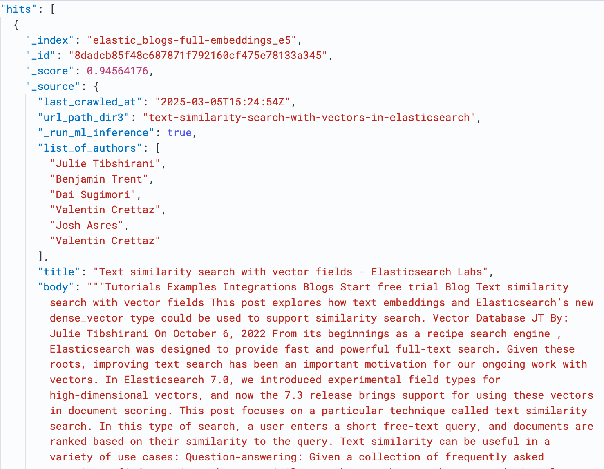

# Semantic Search - Syntax

* Both gives the same results

```
GET my-index/_search
{
"query": {
  "match": {
    "topic.semantic": "What is semantic search?"
  }
 }
}

GET my-index/_search
{
"query": {
  "semantic": {
    "field": "topic.semantic",
    "query": "What is semantic search?"
  }
 }
}


```

*

    <figure><figcaption></figcaption></figure>
